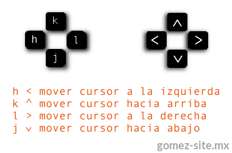
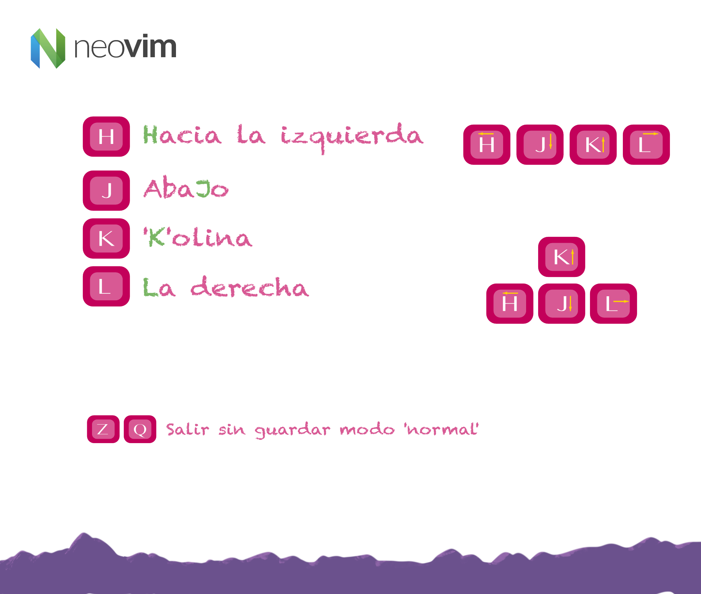

# MODOS NEO VIM

	- Normalmente todos los editores de codigo tienen un solo modo de uso

	- Vim & Neo Vim tienen 4 modos de uso

## 01 Normal Mode

	- Es el modo una vez estemos dentro de Neo Vim y podemos navegar sobre el, Sea el arbol, El documento, etc.

### In & Out

	- In 

		$ nvim

	- Out

		ZQ
		
		:q

###	Arrow keys for navigation 

		H: Left
		J: Down
		K: Up
		L: Rigth

## 02 Insert Mode

	- Es el modo en el que podemos insertar texto

	- In: Entrar modo insert:

		i : Inicia inserccion sobre la letra del puntero

		a : Inicia inserccion despues de la letra del puntero 

	- Out: Salir del modo insert

		Esc

	

## 03 Visual Mode

	-

### Visual mode - Char to Char

	v

### Visual mode - Complet line

	V

### Visual mode - Select rectangular blocks

	Ctrl + v

## 04 Command Line Mode

	-
	
